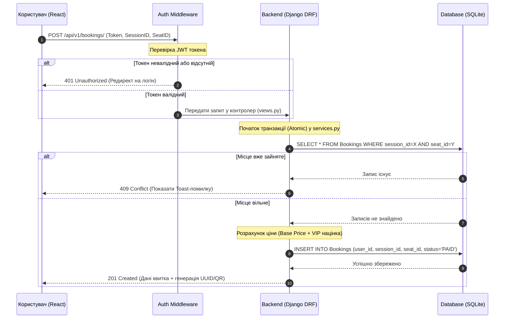

# Технічне завдання: CinemaHub

**Дата затвердження:** 21 квітня 2026 року  
**Команда проєкту:** Матвійчук Р. В., Шило Т. Ю., Вакулюк П. В.

---

## 1. Мета проєкту
Створення комплексного вебзастосунку для автоматизації процесу бронювання квитків у кінотеатрі. Основна мета — забезпечити безшовну та інтуїтивно зрозумілу взаємодію користувача з розкладом сеансів, вибором місць та керуванням замовленнями, а також надати адміністраторам надійні інструменти для управління контентом.

---

## 2. Функціональні вимоги (Сторінки та Інтерфейс)

### 2.1. Каталог фільмів (Головна сторінка)
* **UI Елементи:** Хедер з логотипом, пошуковим рядком (за назвою фільму) та кнопкою "Увійти / Профіль".
* **Відображення контенту:** Сітка карток фільмів. Кожна картка повинна містити постер, назву, вікове обмеження, тривалість та яскраву кнопку "Купити квиток".
* **Фільтри:** Можливість фільтрувати фільми за жанром, датою або показувати лише ті, що "Зараз у прокаті".

### 2.2. Сторінка фільму
* **UI Елементи:** Великий банер на задньому фоні (кадр з фільму), вбудований YouTube-плеєр для трейлера, блок з детальним описом (сюжет, режисер, актори).
* **Вибір сеансу:** Горизонтальна "карусель" або список з датами. Під кожною обраною датою відображаються плашки з часом сеансів та типом залу (наприклад, 2D, 3D, IMAX).

### 2.3. Seat Selection (Інтерактивна карта залу)
* **Візуалізація крісел (4 стани для дизайнера/фронтенда):**
    1. *Вільне (Стандарт)* — базовий колір.
    2. *Вільне (VIP)* — виділено окремим кольором/іконкою.
    3. *Зайняте* — сіре, неактивне (disabled), курсор не змінюється.
    4. *Обране користувачем* — яскравий акцентний колір.
* **Взаємодія:** При наведенні (hover) на вільне місце з'являється Tooltip (підказка) з інформацією: "Ряд X, Місце Y, Ціна: Z грн".
* **Кошик:** Знизу екрана фіксований блок: "Обрані місця: [перелік] | До сплати: [сума] | Кнопка [Оплатити]".

### 2.4. Авторизація та ролі
* **Система локальної авторизації:** Реєстрація та вхід через email та пароль (використання JWT токенів).
* **Користувач:** Має доступ до бронювання та особистого кабінету (перегляд історії покупок, активних квитків з QR-кодами).
* **Адміністратор:** Має доступ до Django Admin для керування розкладом, додавання фільмів (автозаповнення через OMDb API), моніторингу замовлень.

---

## 3. Вимоги до UX/UI та Візуального стилю

* **Стилістика (Dark Mode):** Основна тема застосунку — темна (асоціація з темним залом кінотеатру). Текст контрастний, світлий. Основні кнопки (Call to Action) мають бути акцентного кольору (наприклад, малиновий, червоний або неоново-синій).
* **Стани порожнечі (Empty States):** Дизайн повинен передбачати красиві заглушки для ситуацій: "На цю дату немає сеансів", "Ваша історія квитків порожня", "За вашим запитом фільмів не знайдено".
* **Обробка очікування (Loading States):** Замість білого екрана під час очікування відповіді від бекенда використовувати "скелетони" (сірі блоки, що переливаються) для карток фільмів та карти залу.
* **Людинозрозумілі помилки:** Замість системних помилок (наприклад, "409 Conflict") користувач має бачити акуратне Toast-повідомлення: *"На жаль, це місце щойно викупили. Будь ласка, оберіть інше"*. Обране місце на карті при цьому має автоматично стати "Зайнятим".

---

## 4. Нефункціональні вимоги
* **Продуктивність:** Відгук REST API не більше 300 мс; час рендеру інтерактивної схеми залу на фронтенді — до 1.5 с.
* **Безпека:** Захист від Brute-force атак, безпечне хешування паролів, валідація JWT токенів для захищених маршрутів (endpoints).
* **Надійність (Бізнес-логіка):** Гарантована атомарність транзакцій при бронюванні на рівні бази даних для запобігання подвійному продажу одного місця (Double Booking).
* **Адаптивність:** Коректне та зручне відображення на Mobile, Tablet та Desktop екранах (карта залу повинна підтримувати зум/свайп на мобільних).

---

## 5. Обмеження (Tech Stack)
* **Frontend:** React.js, Vite, Tailwind CSS.
* **Backend:** Python, Django, Django REST Framework (DRF).
* **База даних:** SQLite (для розробки).
* **Локальність:** Власна система автентифікації без залучення сторонніх OAuth провайдерів (Google/Facebook) на першому етапі.

---

## 6. Критерії прийняття (Acceptance Criteria)
1. Інтерфейс (React) відповідає затвердженим UI/UX макетам.
2. Всі інтерактивні елементи мають стани `hover`, `active`, `disabled` (наприклад, кнопка "Оплатити" заблокована, поки не обрано жодного місця).
3. Користувач може успішно пройти повний флоу: Реєстрація -> Пошук фільму -> Вибір сеансу -> Бронювання місця -> Перегляд квитка в кабінеті.
4. Адміністратор може додавати фільми за допомогою IMDb ID (дані підтягуються автоматично).
5. Бекенд-валідація суворо блокує спробу забронювати місце, якщо його статус вже `PAID` або `PENDING`.
6. Відсутність критичних помилок (HTTP 500) при стандартних користувацьких сценаріях.

---

## 7. UML Діаграми

### 7.1. Структура бази даних (Data Models & Attributes)

* **`User`** (Користувачі системи)
  * `id` *(Primary Key, Integer/UUID)* — унікальний ідентифікатор користувача.
  * `email` *(String, Unique)* — електронна пошта (використовується для авторизації).
  * `password_hash` *(String)* — захешований пароль (bcrypt/argon2).
  * `role` *(String/Enum)* — рівень доступу (`Customer` або `Admin`).
  * `is_active` *(Boolean)* — статус акаунта (True за замовчуванням).
  * `created_at` *(DateTime)* — дата та час реєстрації.

* **`Movie`** (Каталог фільмів)
  * `id` *(Primary Key, Integer)* — унікальний ідентифікатор фільму.
  * `imdb_id` *(String, Unique, Nullable)* — ідентифікатор OMDb API для автозаповнення.
  * `title` *(String)* — назва фільму.
  * `description` *(Text)* — детальний сюжет та опис.
  * `poster_url` *(URL)* — посилання на зображення обкладинки.
  * `trailer_url` *(URL, Nullable)* — посилання на YouTube-трейлер.
  * `duration` *(Integer)* — тривалість у хвилинах.

* **`Hall`** (Кінозали)
  * `id` *(Primary Key, Integer)* — унікальний ідентифікатор залу.
  * `name` *(String)* — назва залу (наприклад, "IMAX", "Зал 1").
  * `capacity` *(Integer)* — загальна місткість (розраховується автоматично або задається вручну).

* **`Seat`** (Фізичні місця у залі)
  * `id` *(Primary Key, Integer)* — унікальний ідентифікатор крісла.
  * `hall_id` *(Foreign Key -> Hall.id)* — зв'язок із конкретним залом.
  * `row` *(Integer)* — номер ряду.
  * `number` *(Integer)* — номер місця у цьому ряду.
  * `is_vip` *(Boolean)* — чи є місце підвищеного комфорту (впливає на націнку).

* **`Session`** (Розклад сеансів)
  * `id` *(Primary Key, Integer)* — унікальний ідентифікатор сеансу.
  * `movie_id` *(Foreign Key -> Movie.id)* — фільм, який транслюється.
  * `hall_id` *(Foreign Key -> Hall.id)* — зал, у якому проходить сеанс.
  * `start_time` *(DateTime)* — точна дата та час початку.
  * `base_price` *(Decimal/Float)* — базова вартість квитка (стандартне місце).

* **`Booking`** (Бронювання та квитки)
  * `id` *(Primary Key, UUID)* — унікальний номер квитка (використовується для генерації QR-коду).
  * `user_id` *(Foreign Key -> User.id)* - покупець квитка.
  * `session_id` *(Foreign Key -> Session.id)* - обраний сеанс.
  * `seat_id` *(Foreign Key -> Seat.id)* - обране місце.
  * `status` *(String/Enum)* - поточний стан (`Очкікує оплати`, `Оплачено`, `Відмовленно`).
  * `final_price` *(Decimal/Float)* — підсумкова вартість з урахуванням VIP-націнки.
  * `created_at` *(DateTime)* — час створення замовлення.

### 7.2. Архітектура та послідовність бронювання (Sequence Diagram)

## 7. План роботи та Розподіл ролей

| Роль у проєкті | Виконавець | Основні задачі |
| :--- | :--- | :--- |
| **Архітектор** | **Вакулюк Павло Володимирович** | Проектування БД, API контракти, нагляд за архітектурою. |
| **Backend Розробник** | **Матвійчук Роман Валерійович** | Django REST Framework, Auth, логіка сеансів та бронювань. |
| **Frontend Розробник** | **Шило Тарас Юрійвоич** | React компоненти, Router, інтерактивна схема залу, UX/UI. |
| **Тестувальник (QA)** | **Команда** | Unit та інтеграційне тестування перед деплоєм. |
