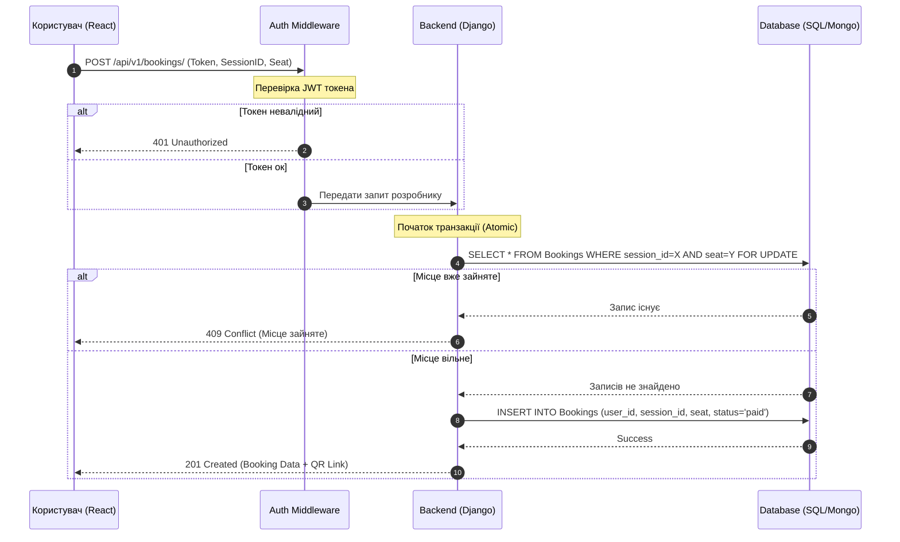

# Технічне завдання: CinemaHub
**Дата:** 21 квітня 2026 року  
**Команда:** Матвійчук Р. В., Шило Т. Ю., Вакулюк П. В.

---

## 1. Мета проєкту
Розробити вебзастосунок CinemaHub - систему для онлайн-бронювання  

---

## 2. Функціональні вимоги

### 2.1. Сторінки та інтерфейс
* **Каталог фільмів:** Головна сторінка зі списком усіх актуальних фільмів, картками з постерами, назвами та рейтингами.
* **Сторінка фільму:** Детальна інформація про фільм, трейлер, опис, список доступних дат та сеансів.
* **Seat Selection:** Інтерактивна карта залу для вибору конкретних місць (реалізація на React).

### 2.2. Авторизація та ролі
* **Система локальної авторизації:** Реєстрація та вхід через email та пароль.
* **Ролі користувачів:**
    * **Користувач:** Перегляд фільмів, бронювання місць, перегляд історії у профілі.
    * **Адміністратор:** Доступ до адмін-панелі для редагування списку фільмів, розкладу та перегляду статистики.

### 2.3. Функціональність бронювання
* Перевірка доступності місця в режимі реального часу.
* Створення запису про бронювання в базі даних та генерація унікального ідентифікатора квитка (QR-код).

---

## 3. Нефункціональні вимоги
* **Продуктивність:** Відгук API не більше 300мс; час завантаження інтерактивної схеми залу до 1.5с.
* **Безпека:** Захист від Brute-force атак, хешування паролів (bcrypt/argon2), валідація JWT.
* **Надійність:** Атомарність транзакцій при бронюванні (запобігання Double Booking).
* **Адаптивність:** Коректна робота на Mobile та Desktop (Tailwind CSS).

---

## 4. Обмеження
* **Технологічні:** Python Django (Backend), React (Frontend), SQLite/MongoDB.
* **Часові:** Завершення розробки до кінця навчального семестру.
* **Локальність:** Власна система автентифікації без залучення сторонніх OAuth провайдерів на першому етапі.

---

## 5. Критерії прийняття
1.  Користувач може успішно пройти повний шлях: Реєстрація -> Пошук фільму -> Бронювання місця.
2.  Адміністратор може керувати контентом через Django Admin.
3.  Валідація не дозволяє забронювати вже зайняте місце.
4.  Відсутність критичних багів (помилки 500) при стандартних сценаріях використання.

---

## 6. UML Діаграми

### 6.1. Use Case Diagram (Варіанти використання)
* **Актори:** Користувач, Адміністратор.
* **Процеси:** * Користувач -> [Перегляд каталогу] -> [Вибір сеансу] -> [Авторизація] -> [Бронювання].
    * Адміністратор -> [Авторизація] -> [Керування фільмами] -> [Моніторинг замовлень].

### 6.2. Class Diagram (Структура даних)
* `User`: id, email, password_hash, role.
* `Movie`: id, title, description, poster_url, duration.
* `Session`: id, movie_id, hall_id, start_time, price.
* `Seat`: id, hall_id, row, number, is_vip.
* `Booking`: id, user_id, session_id, seat_id, status, created_at.

### 6.3. Sequence Diagram (Послідовність бронювання)

---

## 7. План роботи та Розподіл ролей

| Роль у проєкті | Виконавець | Основні задачі |
| :--- | :--- | :--- |
| **Архітектор** | **Вакулюк Павло Володимирович** | Проектування БД, API контракти, нагляд за архітектурою. |
| **Backend Розробник** | **Матвійчук Роман Валерійович** | Django REST Framework, Auth, логіка сеансів та бронювань. |
| **Frontend Розробник** | **Шило Тарас Юрійвоич** | React компоненти, Router, інтерактивна схема залу, UX/UI. |
| **Тестувальник (QA)** | **Команда** | Unit та інтеграційне тестування перед деплоєм. |